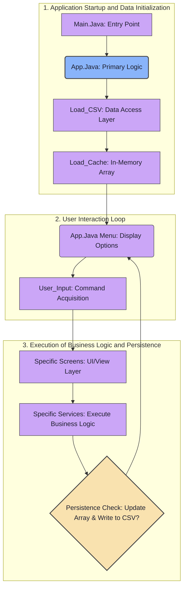

# Ledger Application
Welcome to the **Ledger Application**, a specialized tool designed to help you manage and display your financial data simply and effectively.

## How the Application works

## Cool Functions

### Write to line number
While Writing back to specific CSV files, I realized it would be easier to get the line needed and edit it.
To do so I would read the file line by line and create a ``index`` variable that would increment by 1.
After I find a certain match, I would then use ``replaceLineByIndex(String filePath, int lineNumber, string newLineText)``
The function would find the provided path, get each line and get it as a List, if lineNumber was **greater than** or **equal to 0** and if line Number was smaller then total lines.
Change the targetted array index with new text and write to the file.

###  Console
When working on a previous project, I realized I can create my own utility console file and add specific functions to help create a nice indicator when
the user is doing something right and when the user is doing something wrong.
By creating this class, the class would help me by hurrying and indicating if there is a problem by doing
``console.Success("You're doing a good job");``
or
``console.Deny("Invalid argument")``

    

## What each folder does
### Services
While determining on how I should organize the project, I realized to make the project much easier to read/add on to would be by creating a services folder.
Every file inside of the services folder runs holds all the main functionality in the application such as sorting, writing, reading and any basic utility item.
### Screens
While looking at the project description, I saw the word "screens", I thought the word "screens" as a menu, So I made it in to the pathways which users may enter
a specific Screen by typing one of the following commands on the home menu.
#### Screens Design
This folder carries a set of designs used in the screens.
### Models
Models is viewed as a blueprint, which explains what a model is and what can the model do. The models such as Debit and Transactions helps describe whats going on.
Debit describes what a Debit Card is such as Card holder name, Card holder Address, Card Number, Card CVV, Card Expiration and how much money the card has.
Transaction describes who you paid so far and who you owe.
``src/main/java/org.nigel/models/debit.java``
``src/main/java/org.nigel/models/transaction.java``
### Tests
This folder is when I was trying to work on a feature in a clean plain area. Showing what I was trying to accomplish.
    
